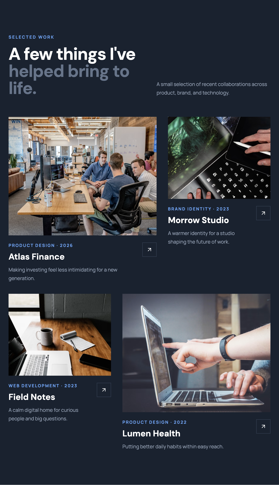

# Northstar Portfolio Template

> A focused portfolio starter for thoughtful digital work.

Northstar is a production-ready React + Vite + Tailwind CSS portfolio template for designers, developers, and creative studios. It is designed to be easy to customize, fast to deploy, and polished enough to use as the foundation for a commercial portfolio.

## Features

- Responsive hero section with profile image, introduction, and calls to action
- Skills grid for presenting services and capabilities
- Project showcase with reusable cards and project detail routes
- Notes/blog archive with individual article pages
- Formspree-powered contact form with success and error states
- Light/dark mode with system preference detection
- SEO metadata, Open Graph tags, favicon, and social preview asset
- Vercel and Netlify SPA routing configuration
- Lazy-loaded images and production-ready Vite build

## Live demo

[View the live demo](https://portfolios-template1.netlify.app/)

Replace the placeholder URL above with your deployed Vercel or Netlify URL once the site is live.

## Preview

### Homepage


### Selected projects



## Requirements

- Node.js 18 or newer
- npm 9 or newer

## Installation

```bash
npm install
cp .env.example .env.local
npm run dev
```

Open the local URL printed by Vite. The site works without a Formspree endpoint, but the form will display a configuration message until one is added.

## Contact form

1. Create a form at [Formspree](https://formspree.io/).
2. Copy the endpoint into `.env.local`:

```bash
VITE_FORMSPREE_ENDPOINT=https://formspree.io/f/your-form-id
```

3. Restart the dev server. The form uses a direct browser `POST`, so no secret server key is exposed.

## Customization

- Replace the placeholder copy and data in `src/components/`.
- Update project images and URLs in `src/components/Projects.jsx`.
- Change the site title, description, canonical URL, and social metadata in `index.html`.
- Replace `public/favicon.svg` and `public/social-preview.svg` with your own brand assets. For social sharing, use a 1200 x 630 image when replacing the preview.
- Adjust colors, fonts, and spacing in `tailwind.config.js` and `src/index.css`.
- Update the contact email and social links in `Contact.jsx` and `Footer.jsx`.

## Scripts

```bash
npm run dev       # Start the development server
npm run build     # Create the optimized production bundle
npm run preview   # Preview the production bundle locally
```

## Deployment

### Vercel

Import the repository into Vercel. It detects Vite automatically. Set `VITE_FORMSPREE_ENDPOINT` in Project Settings, then deploy. `vercel.json` preserves client-side React Router routes.

### Netlify

Import the repository into Netlify with build command `npm run build` and publish directory `dist`. Set `VITE_FORMSPREE_ENDPOINT` under Site configuration > Environment variables. `public/_redirects` preserves client-side routes.

## Performance notes

Remote images use Unsplash width and quality parameters. Below-the-fold project and detail images use native lazy loading and asynchronous decoding. For a final commercial launch, self-host compressed AVIF/WebP assets or use an image CDN and replace the demo URLs.

## License

Released under the MIT License. See [LICENSE](LICENSE).
